> This post is an exercise and all credit goes to this blog - script on Github by  [leeford-Get-TeamsPSTNCallRecords](https://github.com/leeford/Get-TeamsPSTNCallRecords)

There are a couple of ways to retrieve basic information for PSTN calls whether is Microsoft's dial plans or direct routing. The easiest way would be from the Teams' Admin Center -> Analytics & Reports -> Usage Report. 

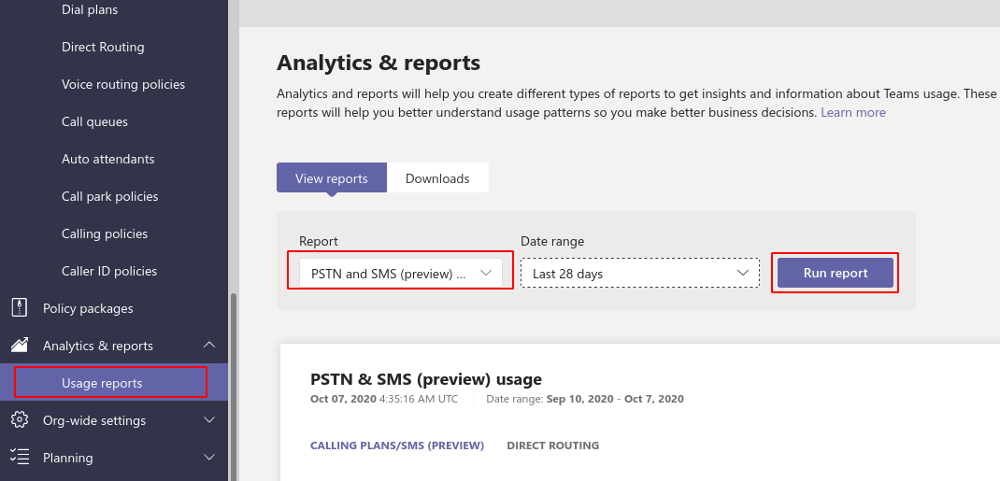

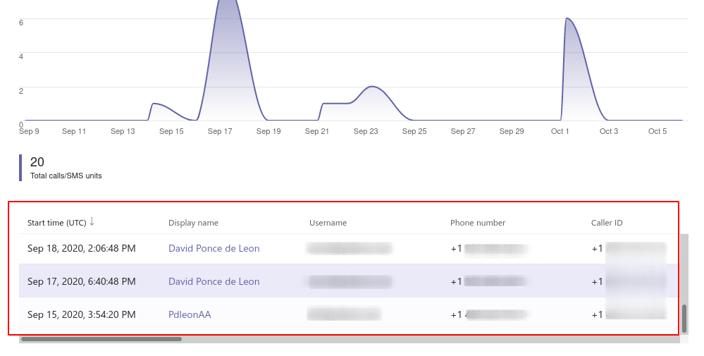

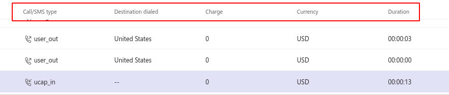

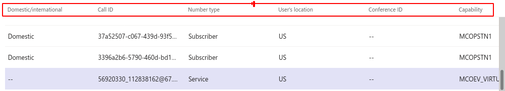

- We can see some basic PSTN call information like ***time, caller, type of call, destination, duration**,* etc but the interface is small and having to navigate up and down and left - right can be  less desirable

- Other options to obtain this data include : Export to Excel which can be useful for some with some additional filters and search capabilities.

Now, if you prefer to have more control, automate or speed up your work flow during troubleshooting or report gathering, well Microsoft Graph API is the preferred way to connect and gather this information. 

Some background to make all this happen:

### From the Microsoft official Documentation 

## Call Record Permissions

One of the following permissions is required to call this API. To learn more, including how to choose permissions, see [Permissions](https://docs.microsoft.com/en-us/graph/permissions-reference).

| Permission type                        | Permissions (from least to most privileged) |
| :------------------------------------- | :------------------------------------------ |
| Delegated (work or school account)     | Not supported.                              |
| Delegated (personal Microsoft account) | Not supported.                              |
| Application                            | CallRecords.Read.All                        |

## Application permissions vs Delegated permissions

This is important to understand because when using the graph explorer you may encounter consent permissions warnings|errors to execute the query as the *CallRecords.Read.All* is specific to an application and not user scope.

- **Application permissions** allow an application in Azure Active Directory to act as it’s own entity, rather than on behalf of a specific user.
- **Delegated permissions** allow an application in Azure Active Directory to perform actions on behalf of a particular user.

#### Application permissions

| Permission             | Display String        | Description                                                  | Admin Consent Required |
| :--------------------- | :-------------------- | :----------------------------------------------------------- | :--------------------- |
| *CallRecords.Read.All* | Read all call records | Allows the app to read call records for all calls and online meetings without a signed-in user. | Yes                    |

### Remarks

The *CallRecords.Read.All* permission grants an **application** privileged access to [callRecords](https://docs.microsoft.com/en-us/graph/api/resources/callrecords-callrecord) for every call and online meeting within your organization, including calls to and from external phone numbers. This includes potentially sensitive details about who participated in the call, as well as technical information pertaining to these calls and meetings that can be used for network troubleshooting, such as IP addresses, device details, and other network information.

### Example usage

#### Application

- *CallRecords.Read.All*: Retrieve a call record (`GET /v1.0/communications/callRecords/{id}`).
- *CallRecords.Read.All*: Subscribe to new call records (`POST /v1.0/subscriptions`).
- *CallRecords.Read.All*: Retrieve direct routing call records within the specified time range (`GET /v1.0/communications/callRecords/microsoft.graph.callRecords.getDirectRoutingCalls(fromDateTime={start date and time),toDateTime={end date and time))`)

> Microsoft provides the ability to test and validate your query through graph explorer but since this is an application specific resource/permission, we get a 403 requesting for consent of an application or in this case not supported

- Back to the original blog/source: We have to register a new application

- Create permissions for an application in Azure -> App Registration -> +New Registration -> Name it however you want it
- Copy the application ID and Directory ID

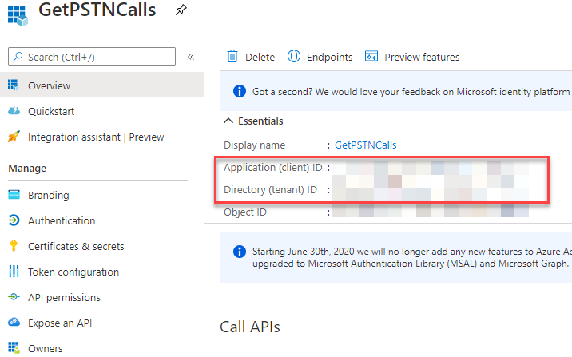

- Create a new client secret and copy your string

  

  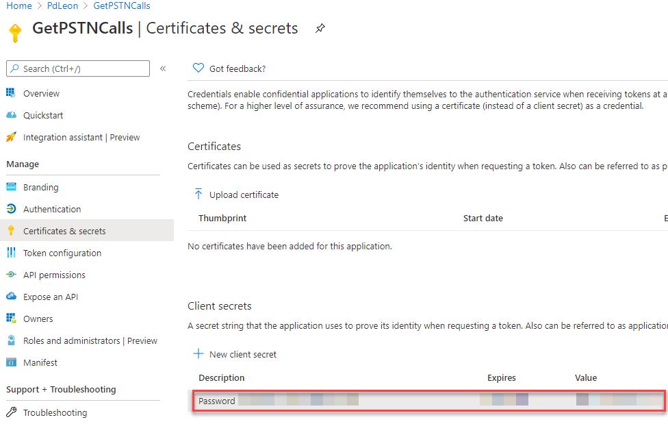

- Back to Azure Active Directory -> Enterprise applications ->%Your App Name% -> Permissions 
  - Make sure that you have the necessary permissions for either your domain or the user to run this application. In this case I am consenting permissions to all users in my organization for test purposes. You can review  and modify the permissions for your application.

    
  
  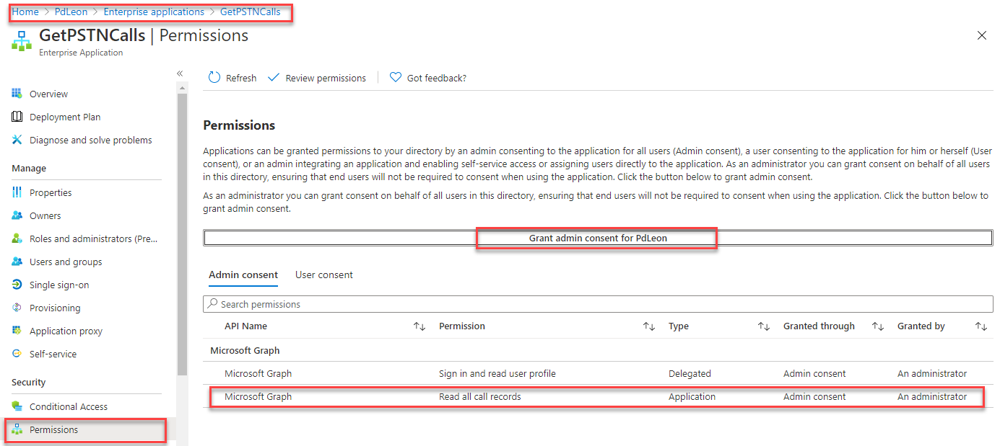

- Back to the github script link below, click on Raw and copy the script to your preferred editor and modify your **applicationid(client), directoryid(tenant), and clientsecret** string as illustrated on his blog.

  [Get-TeamsPSTNCallRecords]: https://github.com/leeford/Get-TeamsPSTNCallRecords/blob/master/Get-TeamsPSTNCallRecords.ps1

  

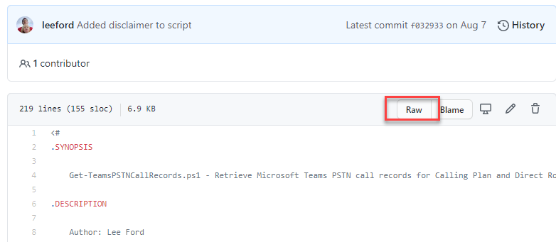

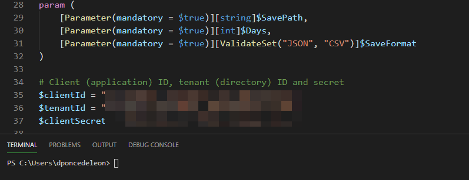

- Let's run and test the script -> currently running on Powershell 7.0.3 but also ran in Powershell 5.1 with success

  

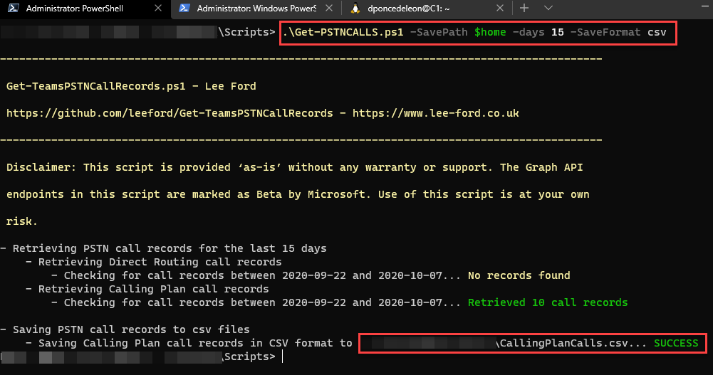

- Everyone has a preference on the output format but I find it's easy to read and follow a json file. Here is a sample of the output:

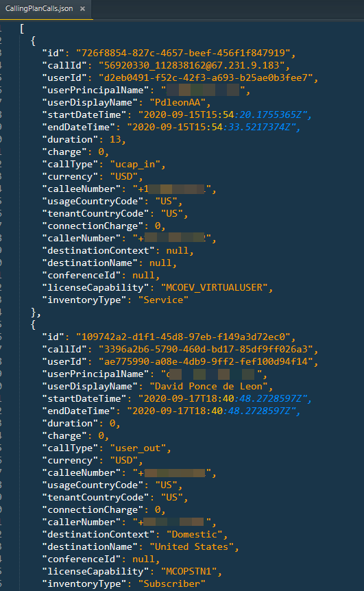

- Final thoughts:
  - Thank you to Lee for this script , great work 
  - Where do we go from here ? Since Microsoft only stores  this information up to 1 year, perhaps there is a need to move this data to another repository whether is a SharePoint List or  the new kid on the block: Microsoft Lists, an external/internal database or simply leave it on a json or csv file for archiving purposes. 
  - What do we do with all this data, we can leverage PowerBi to populate areas of interest or call volume per service/account, trends within your environment but also this could serve to your helpdesk or admin to troubleshoot PSTN calls or to comply with your company governance.