After my final thoughts on my article  [PSTN call records with Microsoft Graph](https://pdleon.github.io/Retrieve-PSTN-Calls-with-Microsoft-Graph/) I wanted to move this data to Microsoft Lists with Power Automate

The benefits are quite a few as expressed before :

- More granular control over how the process is automated via Microsoft Graph Access leveraging all the possible queries and correlating information that Graph offers.
- This process allows to run as a scheduled task or even as an Azure function. For now this is to demonstrate the process but we have to be mindful and aware not to have any confidential or secret information in clear text. This is out of scope for this article.

- Archives and Records Management ( > than 1 year)

- Teams' offline access to this data
- Microsoft Lists functionality and integration with flow and power automate


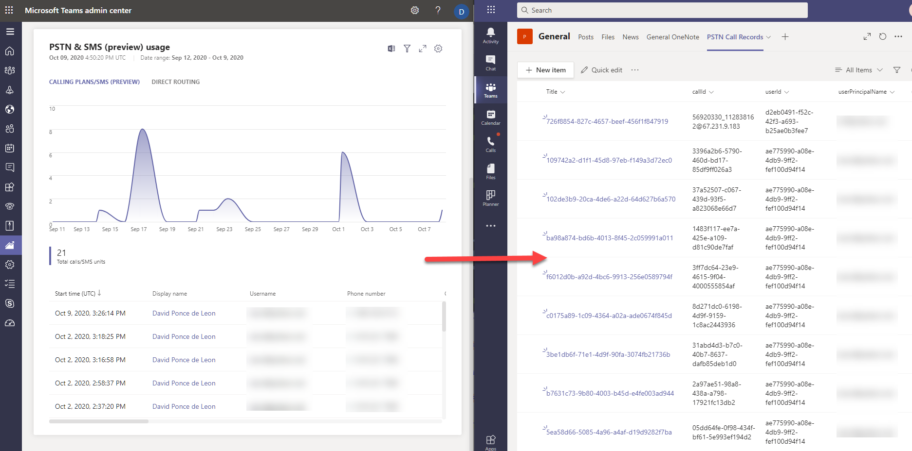


## The goal

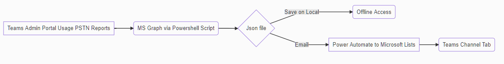


> Ideally, Microsoft teams' portal would offer this seamless interoperability but as of today, it's not possible so here is my workaround to this goal


- Back to the previous article, the output generates an offline file in either json or csv format. My preference is to work with a json file.
- Add  a few lines to the Powershell script at the end to automatically send an email to an account in O365 to leverage Power Automate 


```powershell
$creds= import-Clixml -Path "Yourpath\file.txt" # --> Prior to adding this line, I exported my credentials to an offline file
$mailparameters = @{
From ='username@yourdomain'
smtpserver = "smtp.office365.com"
subject = "Your Custom Subject"
credential = $creds
body= 'Your email body'
Port = 587
UseSsl = $true
}
get-childitem "Your Saved local folder\jsonfile.json" | Send-MailMessage @mailparameters -to $EmailTo # -> $Emailto variable or hard coded email address
```


This part should take care of scheduling or running a script on demand, retrieving the records and automatically sending an email. 


## Microsoft Lists Prerequisites

- **Option 1:** Create a new blank list and enter all the column fields manually from the json or csv file ( all as single line of text type)

  

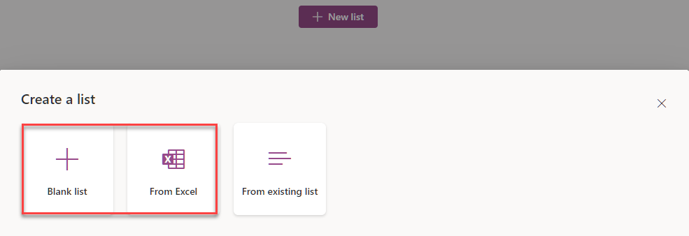

- Open the csv file in excel, delete all the data except the headers and save as excel .xlsx format. Open the file and format the headers as table. It should look similar to this

  

  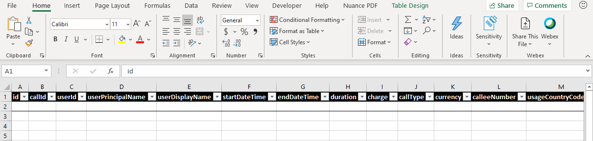


- **Option 2:** Create a list from Excel ( prior step ) and follow the import wizard steps. For simplicity, all my fields will be of the type *single line of text*

  

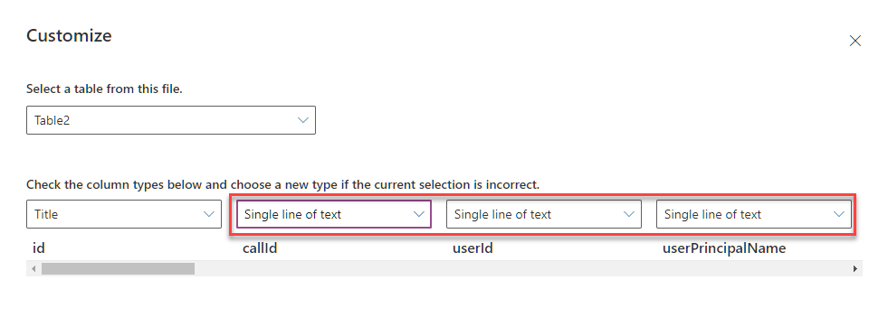


## Power Automate Summary

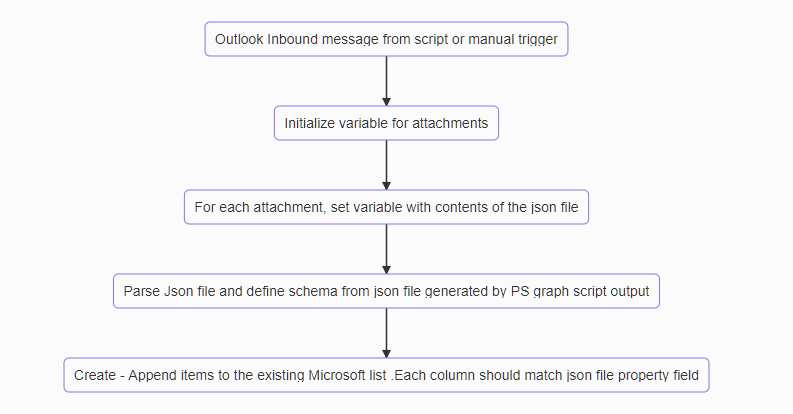


## Power Automate Flow

> Adapt this to your own needs


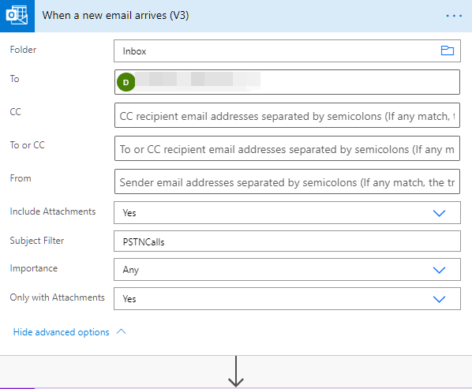

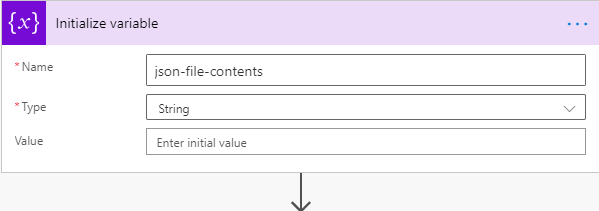

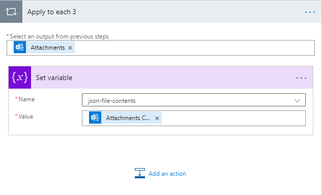

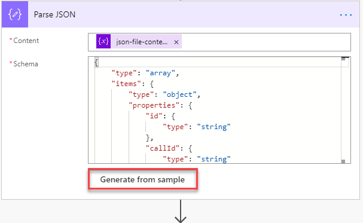

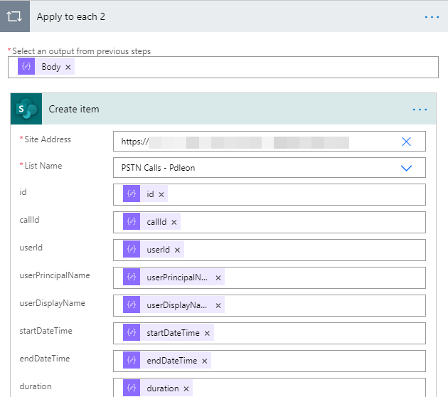


## Microsoft Lists

> Our final result after running this flow would look like this


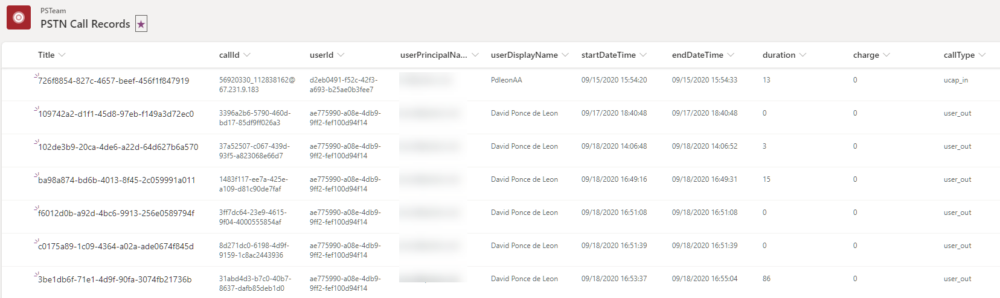


## Microsoft Teams Integration

- Very simple process to add this list as a tab in any of the channels that have permission to access the list and you are done. 

  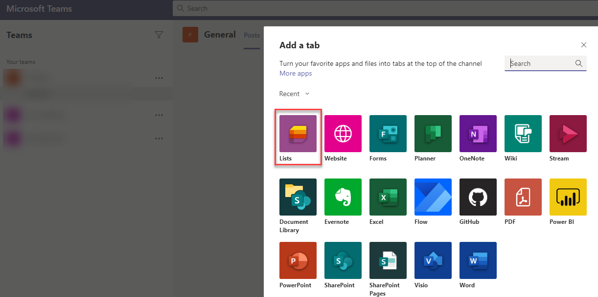

  

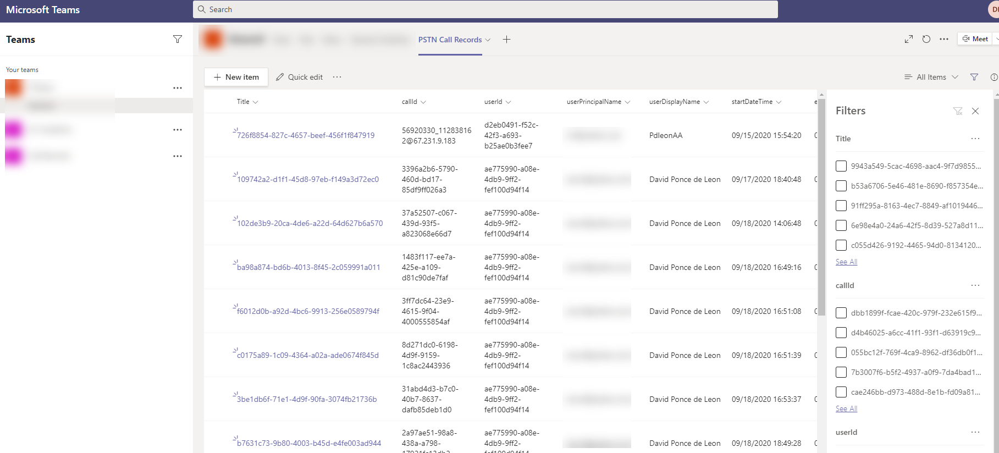


## Final Thoughts

- This solution may or may not be worth your time and effort but definitely could be handy when integrating all the Microsoft ecosystem and tools available today part of an automated process so why not ?
- The cadence to run and gather this data is up to you, so careful planning and testing has to be done with the dates within the script in order not to duplicate data
- This is not a real time solution or substitute to any third party tool, use it as is and adapt it to your needs
- You can either work directly in the lists portal and manipulate this data, template and integrate it with flows and power automate to receive alarms, etc.
- PowerBi next from here ? Possibly on the next article.
- I hope this is useful to someone out there . Enjoy!