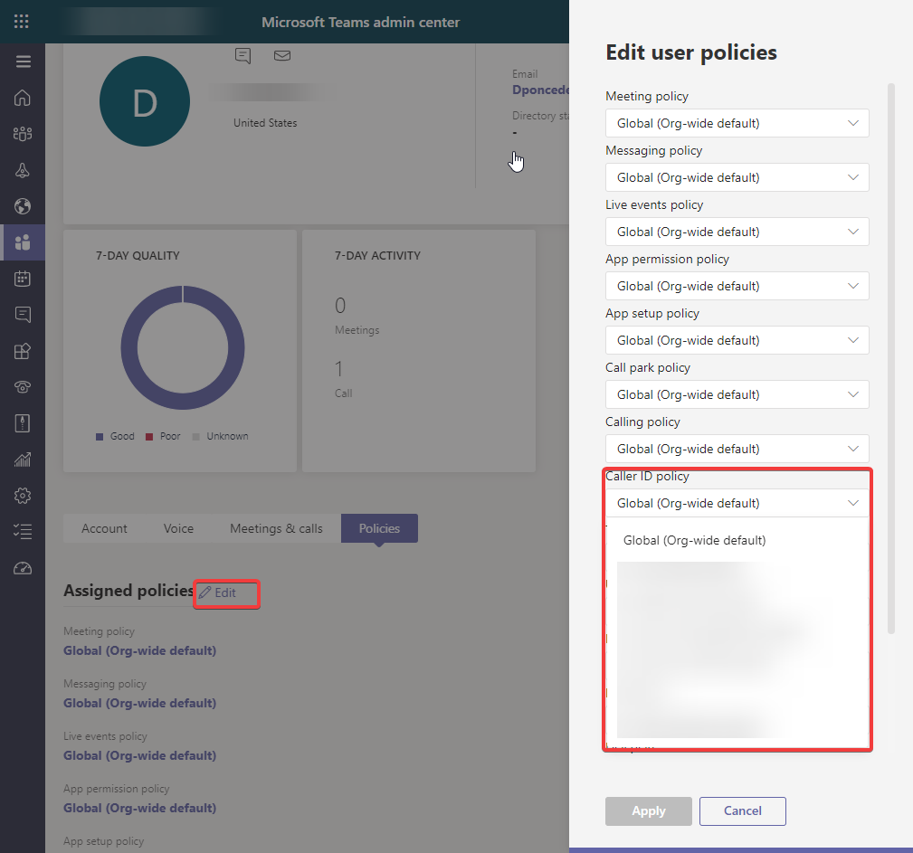
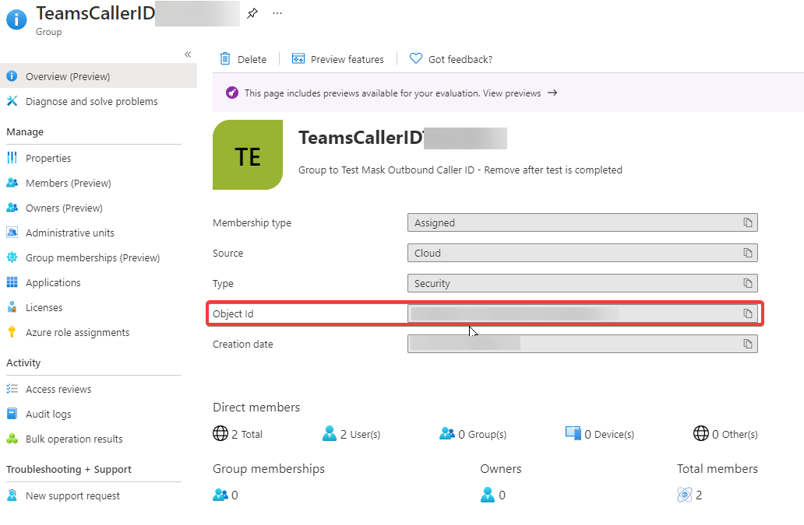
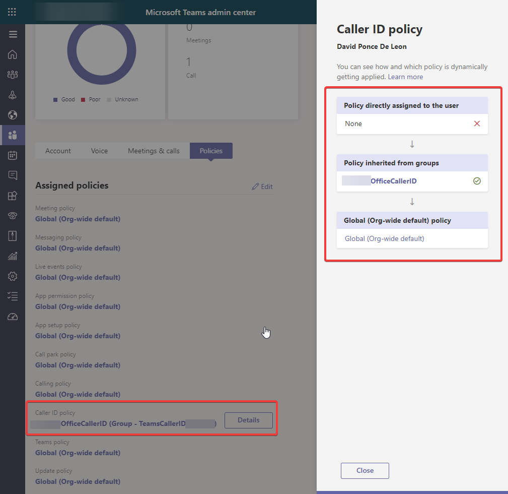

# Request

To mask outbound caller ID by location with the corresponding office number DID which is onwed by their direct routing solution and assigned to an AutoAttendant Resource Account.

# Procedure

We are not going to cover in detail how to assign a Direct Routing DID to a Resource Account but high level steps:

- Create new Resource Account through Admin Portal or through Powershell ( AutoAttendant or CallQueue ); Autoattendant in our case
- Assign the proper license to the Resource Account
- Assign desired number to the Resource Account through powershell only


```powershell
Set-CsOnlineApplicationInstance -Identity ResourceAccountAA@domain.com -OnpremPhoneNumber +1(XXX)XXX-XXXX
```

---

Now that we have covered how the AutoAttendant gets the desired main office number, we can start creating a new policy for masking every outbound call.

- Obtain Object ID of the AA Resource Account covered previously
- Create a new calling line identity policy and substitute with the Resource Account objectid

```powershell
$Id = (Get-CsOnlineApplicationInstance -Identity ResourceAccountAA@domain.com).objectid
New-CsCallingLineIdentity -Identity "OfficeCallerID" -CallingIDSubstitute Resource -EnableUserOverride $false -ResourceAccount $Id -companyname "Company Name"
```

# Assignment

We have a couple of ways to do this :

- Direct assignment to a user through powershell or in the Teams Admin Center - Users ; then editing the policies and assigning the new policy



- Since users will have a different outbound number based on location tied to a different AutoAttendant (Repeat all the steps above to create another AA on a different location) we are going to assign policies to a security group that has membership based on location.

- Create a new security group in Azure AD or use an existent one that covers all the members in the desired location



- Assign the policy to the group just created:
  - Grab the group id through the group properties in Azure AD or powershell
  - The rank is important for which policy takes precendence if the account is part of several group policies

```powershell
 New-CsGroupPolicyAssignment -GroupId xxxxxxxx-xxxx-xxxx-xxxx-xxxxxxxxxxxx -PolicyType CallingLineIdentity -PolicyName "OfficeCallerID" -rank 1
```
The policy now is assigned to a group and the hierarchy of assignments is direct|group|global



# Final Thoughts

This solution works great if the onboarding process takes care of adding new hires to the proper security group in AD based on their locatio and no need to worry about Teams policies.