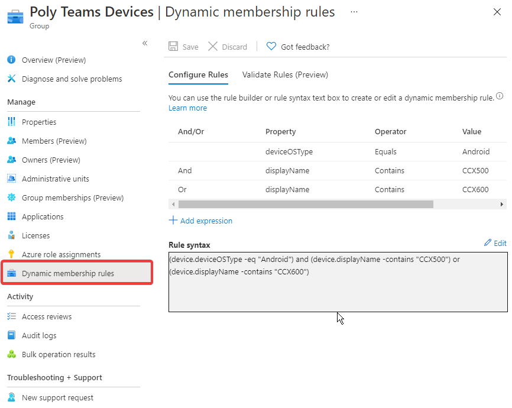
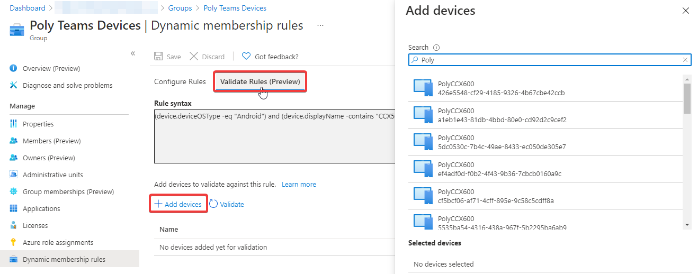
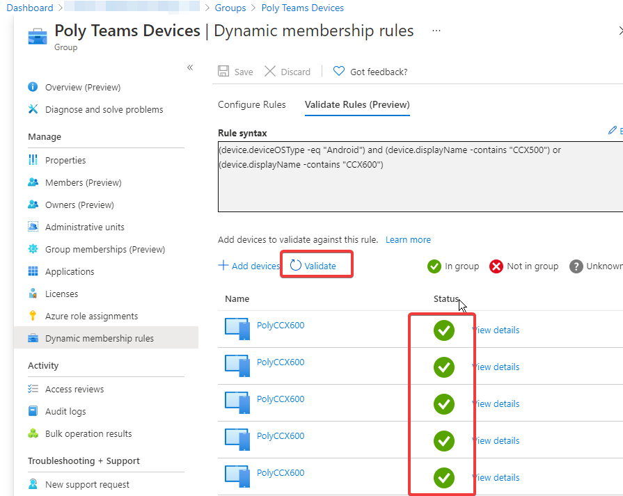

# Issue

Recently encountered an issue where IP Phones (Polycom CCX) were unable to register to Azure AD and would not appear in the Microsoft Teams Admin Center list of IP Phone devices. Most times this should not be an issue except if the company has Intune enabled and endpoint manager resctricting devices from registering due to compliance policies.

# Solution

I knew there were some recommendations to exclude these phones from any device compliance as it could create more harm than good and not gaining a full set of features for these devices since all software and firmware can be pushed through the teams admin center.

Modern practices for Intune recommend to disable or block device administrator for android since it's considered legacy, grants a lot of permissions to the device and lacks of total separation between work an personal profile.

Digging into the logs, I noticed the device was getting blocked by platform restriction.

Conditional access and android compliance policies will apply to any android based device which means an Intune license needs to be applied to the user and the setting for Android device administrator needs to be enabled for proper enrollment of Ip Phones.

To exclude those phones from any android compliance policy that could affect these phones or user registration, we completed these steps:

- Create a security group in AD with dynamic membership rules. In our case we have two Polycom phone models CCX500 and CCX600.

- Validate the rules, add devices and make sure the rules are align with the syntax.

- In Endpoint manager, search for the android compliance, add previously created security group to the excluded groups

We are ready to sign in to the device and test proper registration to Azure AD and Teams admin portal.

During this process, for best results, we had to delete all previous instances for Intune and AD device objects and reset the IP phone to factory defaults to have a clean device registration.

# Final thoughts

Intune is a great product but I don't find a lot of added benefit to manage these IP phones when Teams Admin Center and Azure AD can do enough administration to serve as device inventory and also to manage firmware and other app updates. Your situation and opinion may differ.