# Introduction

Webinar is a new feature in Teams designed for up to 1,000 attendees with the ability to use a registration form, all the built in meeting features and a hidden feature of a Microsoft list where automation could be leverage for added control. I discovered this feature from Steven Collier Youtube's channel here -> https://youtu.be/0NAxfP6gulw

> Two quick guides from Microsoft with all the features and usage.

- https://www.microsoft.com/en-us/microsoft-365/blog/2021/05/11/introducing-webinars-in-microsoft-teams-easy-professional-webinars-to-engage-customers/
- https://teamworktools.azurewebsites.net/assets/TeamsWebinarsGetStartedGuide.pdf

**Step by Step:**

# Enable Webinar Feature - Powershell Only

Applicable settings: This will depend on your global or custom meeting policy.

Identify current values in your policy. In this case, whocanregister is set to "EveryoneInCompany" which means External or Guest would not be able to register. Change the value to "Everyone" if you want external access to be able to register.

```powershell
Get-CsTeamsMeetingPolicy -Identity global | select allowprivate*,allowmeetingreg*,allowengage*,who* | fl
```

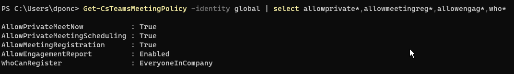

## Set-CSMeetingPolicy -> Powershell Parameters of Interest

### WhoCanRegister

Controls the attendees who can attend a webinar meeting. The default is Everyone, meaning that everyone can register. If you want to restrict registration to internal accounts set the value to 'EveryoneInCompany'.

Possible values:

- Everyone
- EveryoneInCompany

### AllowMeetingRegistration

Controls if a user can create a webinar meeting. The default value is True.

Possible values:

- True
- False

 ### AllowPrivateMeetingScheduling
Determines whether a user can schedule private meetings. Set this to TRUE to allow a user to schedule private meetings. Set this to FALSE to prohibit the user from scheduling private meetings.

> Note: This only restricts from scheduling and not from joining a meeting scheduled by another user.


 ### AllowEngagementReport
Determines whether meeting organizers are allowed to download the attendee engagement report. Possible values are:

- Enabled: allow the meeting organizer to download the report.
- Disabled: disable attendee report generation and prohibit meeting organizer from downloading it.
If set to enabled, only meeting organizers will get a link to download the report in Teams. Regular attendees will have no access to it.
---

It will finally look like this since I'm editing my global config and all my parameters are as how I need them. I want to enable external access registration.

```powershell
set-csteamsmeetingpolicy -whocanregister everyone
```

# Webinar Meeting Creation

Open up your calendar in Teams, and create a new Webinar.

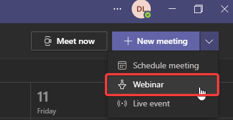

Set registration requirement. Since we changed the value for external people to register, we can select for everyone. Click on View Registration Form

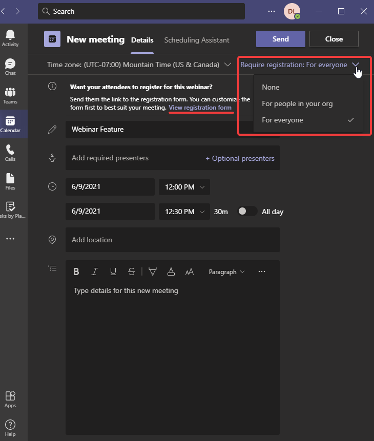

It will open up the form to be customized by your event logo and additional fields as required. Save and Copy your registration link to email over your distribution list.

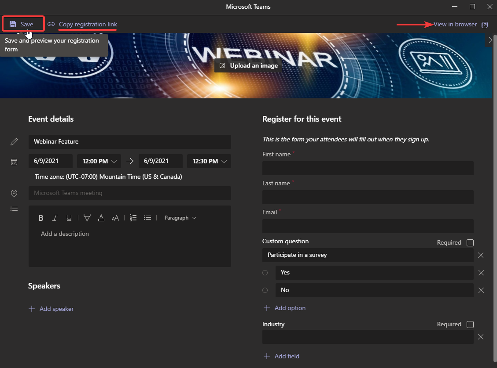

Inside the meeting, we can see there is a registration file that can be downloaded to identify people that registered to the webinar.

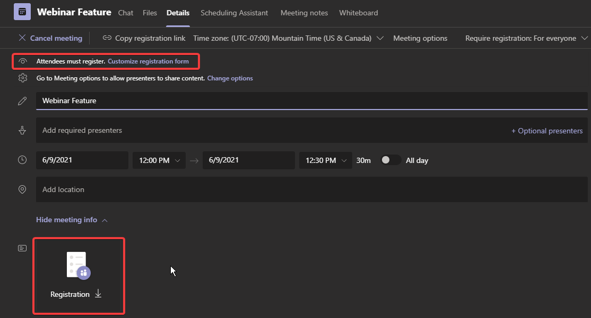

At the moment of creation, the list will appear empty.

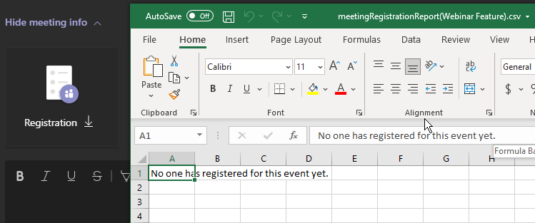

File registration will start auto populating all the fields after users register to the event.

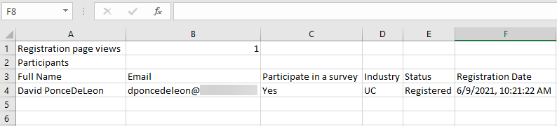

# Microsoft List Hidden Feature

To uncover and display the Event, Questionnaire and Speaker List we have two options:

1. Open up OneDrive -> Return to Classic OneDrive -> Settings (Gear) -> Site Contents
2. Replace OneDrive home's URL of .../layouts/15/onedrive.aspx -> .../layouts/15/viewlsts.aspx

The one we are interested in at the moment is the Questionnarie file.

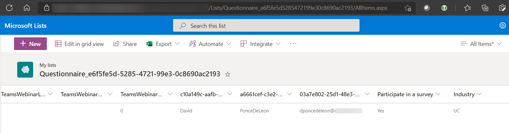

We can leverage Power Automate to have more control and automatation to a multitude of actions within power automate.

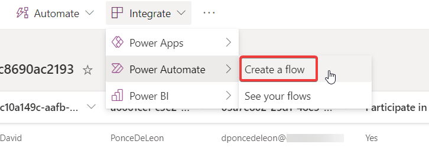

We'll create a standard email notification after the user is registered.

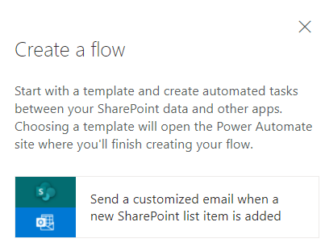

Standard flow, nothing complex about it. Now every time some registers, additionally to the csv file in the meeting invite, I get a nice email with details on users that registered. We could easily send it to a database or a teams' channel or any other sort of marketing campaign.

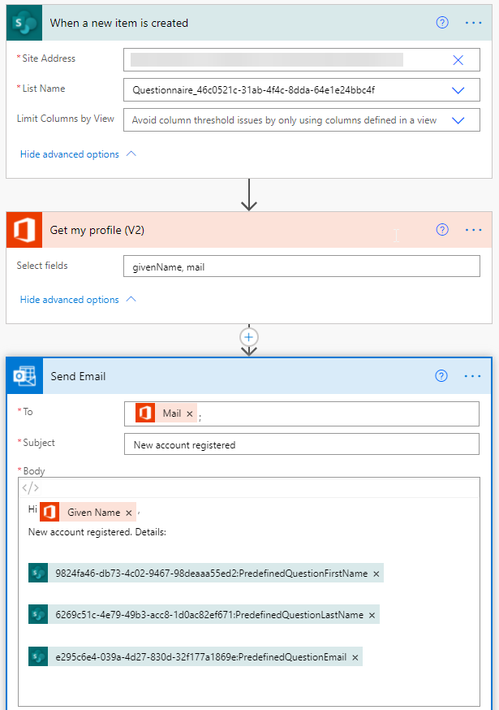

# Final Thoughts

Teams' Webinar is a nice new feature with all the capabilities of Teams' meetings which allows for better collaboration and engagement to a large group instead of leveraging Live Event which turns into a one way audio. As for the automation, it's a manual process for now that may or may not work for everyone depending on the volume of webinars created.