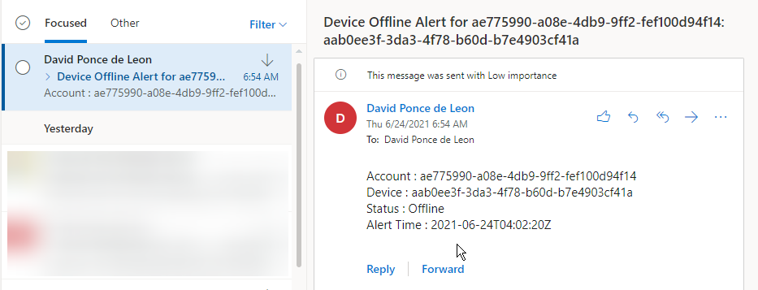

# Initial Thoughts

This new feature capability offered in the Teams Admin Center is a nice complementary option to monitor devices and alert Admins when they go offline.

A great use scenario is for Conference Room devices or Executive level phones and while it's not preventative, it does help Admins to react fast when devices go offline whether at a individual or site level.

# Configuration

- Validate permissions to create a Team/Channel

- Navigate to Teams Admin Center | Notifications and Alerts | Rules

- Rule Type, Condition and Scope settings are greyed out and cannot be configured.

## Add Device Users

My account is logged in to a couple of devices. For a few users, this is not a problem but you can imagine doing this for 500 +

## Configure Actions for Channel Alert or Webhook

Use your custom channel or leave the default channel alert. Initial configuration will create this for you.

## Webhook Configuration

Initially I tested with a standard M365 email connector webhook but that didn't work probably due to mismatch of the json payload. Looking at the documentation, it has a custom payload schema and just for testing purposes decided to use a power flow inbound webhook that will send an email alert.
This is a premium feature but you can enable a 90 day trial for testing purposes and integrate it to another third party solution or adapt it to your needs.
During this test, I dit not obtain the user and device GUID so it requires additional work as the schema will not correlate the user and device GUID displayname.

# Alert Notifications

## Teams Channel Notification View

Basic veiw but works well, from there you can either automate your own logic to this notification or just leave it in the channel. One thing that wasn't accurate for me was the alert time, the documentation says the json schema is in UTC but the alert time did not match neither my time zone nor UTC time. I will continue to test on this.

The webhook email alert may not be very helpful due to the user and device GUID but is an option. One thing that does match is the UTC time of the alert compared to the team channel alert.

# Final Thoughts

This is possibly a first of many to be added rules in the Admin Center and while is a good initial attempt, I feel it needs to allow Admins for more configuration. Curious when and how this will be developed into a more robust reactive alerting process or to allow Admins to generate more rules. This is just complementary alerting and anoter tool in the arsenal.

As of today, I didn't find a powershell command to generate a new rule or customize it to other scenarios.

The Scope section, Frequency of Evaluation "Real Time" will depend on the heartbeat accuracy of the device back to Microsoft. During my test, my phones were completely unplugged and took about 30 minutes to report that they were offline on the dashboard. Once device status is offline, the team channel alert was instant along with my webhook rule.

The Webhook alert is great option but needs additional work to retrieve User and Device GUID, otherwise would take time to correlate against a script or database or any spreadsheet containing all these values and determine which device went offline. For a single device, this is easy but think of a company with 500 + devices.

One scenario I did not test is during a firmware or app upgrade but I'm guessing depending on how fast the phone reboots reports a heartbeat, may or may not trigger this alert.
